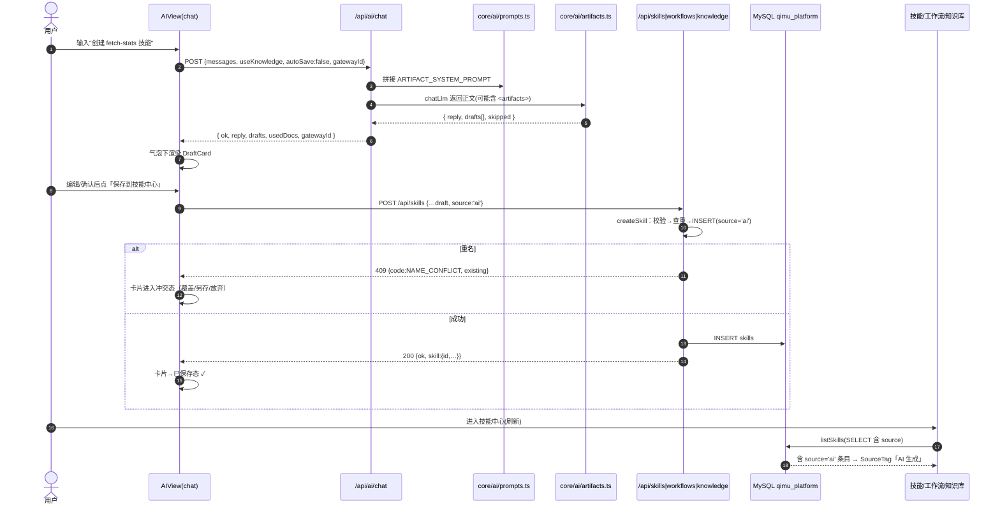
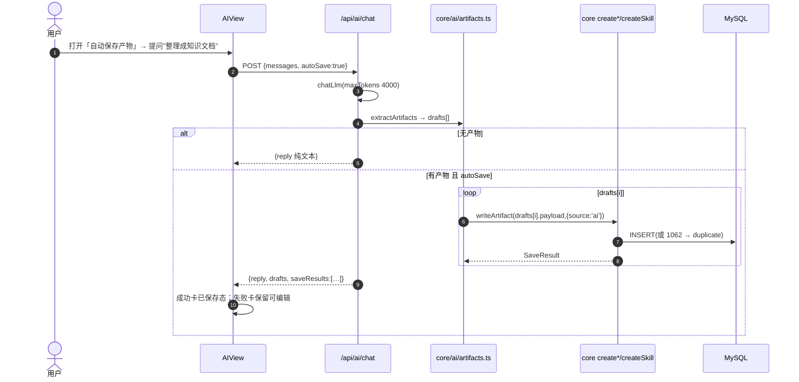
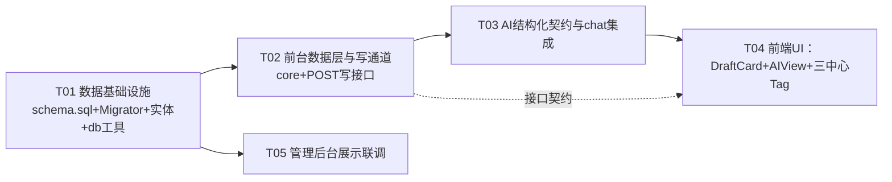

> 历史设计与验证记录：自动保存产物功能现已移除（包括开关、持久化状态、请求参数和聊天接口自动入库分支）。当前仅支持草稿手动保存，下文涉及自动保存的描述不再适用。

# AI 产物「创建即入库」系统设计与任务分解（ARCHITECTURE）

> 代号 `ai_creation_integration` · 架构师：高见远（Bob）
> 关联文档：[PRD.md](./PRD.md)
> 适用范围：alon-workbench 前台（Next.js 15 + AntD 6）+ admin-platform（Spring Boot 3.2.5）共享 MySQL `qimu_platform`
> 约束：只做设计不改业务代码；网关侧**不做 function calling**，保持文本 chat/completions；运行记录类（skill_runs/runs）不在本次范围。

---

## 0. 关键结论（代码核对后新增，先读）

1. **`source` 字段语义冲突（重要）**：现状 alon-workbench 前端 `SkillRecord.source / WorkflowRecord.source` 存的并不是"来源标识"，而是 **原始 YAML 定义文本**（`parseSkillFile(file, dir, source)` 把 `source`=文件内容塞进 def；`SkillsView`/`WorkflowsView` 抽屉用它做"查看 skill.yml/YAML 定义"）。admin 的 WorkflowController 建流时 `def.source='admin'` 又是来源标识。**命名同、语义不同**。
   → 本次把 DB 新列命名为产品要求的 `source`（来源标识 `manual|file|ai`），就必须在 TS 层做语义拆分，否则"AI 生成"与"源码查看"会互踩。详见 §3.4 归一化约定。
2. **Spring 技能/工作流 name 正则实际为 `[a-z0-9][a-z0-9-]*`**（首字符允许数字，`SkillController:93`、`WorkflowController:109`），并非"必须小写字母开头"。为与后台同库语义对齐，前台写接口采用**同一正则**；AI 提示词建议模型用字母开头 slug，服务端不强制。
3. **admin 端 schema.sql 只在一次性 SqliteMigrator 里被整段执行**（`SqliteMigrator.java` 读 `db/schema.sql` 按 `;` 执行，普通启动不建表）；docker 环境没有单独 init 入口。→ 自动补列需要一个**幂等迁移组件**放在 admin-platform 启动时（§3.1），同时前台读端做"列不存在降级"，双保险。
4. **shell 技能执行兜底确认**：alo-workbench `runSkill`（`core/skills.ts:398`）shell 分支 `cwd: path.join(SKILLS_DIR, c.dir || rowData.name)`，若目录不存在会 `ENOENT` 失败；admin 端 `SkillExecutor.runShell` 不使用 dir/cwd，无此问题。→ 仅需改前台 `runSkill`：目录不存在时回退到 `SKILLS_DIR`（§5.2 最小改法）。
5. **zod@3.24.1 已在 alon-workbench package.json**，可直接复用；无需新增第三方依赖。

---

# Part A：系统设计

## 1. 实现方案（Implementation Approach）

### 1.1 核心难点
- 让"纯文本 chat/completions"稳定产出**可解析的结构化草稿**（不改网关协议、无 function calling）。
- AI 产物写共享 MySQL 后，**前台三中心与管理后台同源可见**，且带统一"AI 生成"来源标记；schema 需幂等升级。
- 一套校验规则同时被 **chat 服务端自动保存** 与 **三个写接口手动保存** 复用，语义对齐 Spring 版。
- 现有 `source` 字段（原文展示）与新产品要求的 `source` 列（来源标识）冲突，需在类型/读端做归一化。

### 1.2 选型与架构模式
| 关注点 | 方案 | 理由 |
|---|---|---|
| 模型输出结构化 | 系统提示词注入三份紧凑 JSON Schema + `<artifacts>[...]</artifacts>` 包裹 + 服务端提取/校验 | 对主流 OpenAI 兼容网关最稳：不依赖 tools 参数；标签比 ```json 围栏更抗模型加料；失败仍回纯文本 |
| 服务端校验 | zod@3.24（`core/ai/artifacts.ts`）+ 写入器深校验（复用 core/skills、core/workflows 语义） | 已装依赖；安全解析 + 人话错误 |
| 数据访问 | 沿用 `core/db.ts`（rows/row/exec/withTransaction），新增幂等列检查工具 | 零新依赖 |
| schema 升级 | admin-platform 启动 `ApplicationRunner` 迁移 + `schema.sql` 更新 + 前台读端降级 | 本地库/Docker 库都自动补齐；重复启动安全 |
| UI | AIView 气泡下方渲染独立 `DraftCard`（可编辑表单 + 保存/冲突三选一）；工具栏加自动保存 Switch | 最小侵入，ChatMarkdown 不动 |
| 写入通道 | 前台新增 `POST /api/skills`、`POST /api/workflows`（直写共享 MySQL），知识复用 `POST /api/knowledge` | 决策 #4：同源直写，少一跳 |
| 命名冲突 | 写接口 409 + `code:"NAME_CONFLICT"`，前端三选一（覆盖/另存/放弃） | 对齐 Spring 语义扩展 |

### 1.3 产物目标形态（与 DB/后台 JSON 完全一致）
- skill：`config` JSON = `{ displayName?, description?, color?, params[], config:{ shell|prompt|http:{...} }, dir: name }`（dir 恒为 name）。
- workflow：`definition` JSON = `{ displayName?, description?, color?, params[], steps[], source? , file: name+".yml" }`（新增列后 `source` 以列为准，definition 内不再强依赖）。
- knowledge：docs 行（title/category/tags/content），分类由 `ensureCategory` 兜底。

---

## 2. 文件清单（File List）

前缀 `A/` = alon-workbench（前台），`B/` = admin-platform（后台/共享库）。

| # | 文件 | 新增/修改 | 职责 |
|---|---|---|---|
| 1 | A/`core/db.ts` | 改 | 新增 `ensureSourceColumns()`、`withColumnFallback()`（列缺失降级） |
| 2 | A/`core/ai/artifacts.ts` | 新增 | Draft/SaveResult 类型、zod schema、`extractArtifacts`、`normalizeDraft`、`writeArtifact` 编排 |
| 3 | A/`core/ai/prompts.ts` | 新增 | 常量 `ARTIFACT_SYSTEM_PROMPT`（三份紧凑 Schema + 输出协议说明） |
| 4 | A/`core/skills.ts` | 改 | SkillRow/Record 增 `source`(标识)+`sourceText`(原文)；SELECT 双变体；`createSkill`；shell cwd 兜底 |
| 5 | A/`core/workflows.ts` | 改 | WorkflowRow/Record 同上；`createWorkflow` |
| 6 | A/`core/knowledge.ts` | 改 | DocRecord/ListItem 增 `source`；SELECT 补列；`createDoc(input,user,opts?)` |
| 7 | A/`app/api/skills/route.ts` | 改 | 新增 `POST`（校验/409/写入） |
| 8 | A/`app/api/workflows/route.ts` | 改 | 新增 `POST` |
| 9 | A/`app/api/knowledge/route.ts` | 改 | `POST` 接受 `source`（白名单） |
| 10 | A/`app/api/ai/chat/route.ts` | 改 | 注入产物提示、解析 drafts、autoSave 自动落库、返回 saveResults |
| 11 | A/`components/ai/DraftCard.tsx` | 新增 | 草稿卡（预览/编辑/保存/已保存/冲突三选一） |
| 12 | A/`components/ai/AIView.tsx` | 改 | ChatItem 扩展、气泡下渲染 DraftCard、自动保存 Switch、localStorage |
| 13 | A/`components/SourceTag.tsx` | 新增 | 共享 `AI 生成` Tag（geekblue+RobotOutlined），供三中心复用 |
| 14 | A/`components/skills/SkillsView.tsx` | 改 | 卡片/抽屉加来源 Tag；原文展示改用 `sourceText` |
| 15 | A/`components/workflows/WorkflowsView.tsx` | 改 | 同上 |
| 16 | A/`components/knowledge/KnowledgeView.tsx` | 改 | 列表/详情加来源 Tag |
| 17 | B/`admin-backend/src/main/resources/db/schema.sql` | 改 | 三表 CREATE TABLE 增加 `source` 列（新装即含） |
| 18 | B/`admin-backend/src/main/java/com/alon/admin/migration/SourceColumnMigrator.java` | 新增 | `ApplicationRunner` 幂等补列 |
| 19 | B/`admin-backend/.../entity/Skill.java` | 改 | 加 `private String source;` |
| 20 | B/`admin-backend/.../entity/Workflow.java` | 改 | 同上 |
| 21 | B/`admin-backend/.../entity/Doc.java` | 改 | 同上 |
| 22 | B/`admin-backend/.../controller/SkillController.java` | 改 | list/detail 透出 `source`（列优先，JSON 兜底） |
| 23 | B/`admin-backend/.../controller/WorkflowController.java` | 改 | 同上 |
| 24 | B/`admin-backend/.../controller/KnowledgeController.java` | 改 | 同上 |
| 25 | B/`components/skills/SkillsManager.tsx` | 改 | 列表行加来源 Tag |
| 26 | B/`components/workflows/WorkflowsManager.tsx` | 改 | 同上 |
| 27 | B/`components/knowledge/KnowledgeManager.tsx` | 改 | 同上 |
| 28 | A/`docs/ai-creation-integration/sequence-diagram.mermaid` | 新增 | 时序图（交付物） |
| 29 | A/`docs/ai-creation-integration/class-diagram.mermaid` | 新增 | 类图（交付物） |

> 注：`app/api/knowledge/[id]/route.ts`、`app/api/skills/[id]/route.ts` 等只读/执行路由**不需要**改动；`core/api.ts`、`ChatMarkdown.tsx` 不动。

---

## 3. 数据结构与接口（Data Structures & Interfaces）

### 3.1 DB schema 变更与迁移

三表新增统一列（schema.sql 同步更新）：

```sql
ALTER TABLE skills     ADD COLUMN source VARCHAR(16) NOT NULL DEFAULT 'manual' AFTER config;
ALTER TABLE workflows  ADD COLUMN source VARCHAR(16) NOT NULL DEFAULT 'manual' AFTER definition;
ALTER TABLE docs       ADD COLUMN source VARCHAR(16) NOT NULL DEFAULT 'manual' AFTER created_by;
```

**迁移策略（双保险、幂等）**
- 主迁移：admin-platform 新增 `SourceColumnMigrator implements ApplicationRunner`（放 `migration` 包，与 SqliteMigrator 并列），启动时执行：
  1. `SELECT COUNT(*) FROM information_schema.columns WHERE table_schema=DATABASE() AND table_name=? AND column_name='source'`（每表一次）；
  2. 缺列才执行对应 `ALTER TABLE ... ADD COLUMN ...`（MySQL 8 无 `ADD COLUMN IF NOT EXISTS`，用 information_schema 判断）；
  3. 每步 try/catch 记 WARN 不阻断启动；重复启动无副作用。
- 兜底（前台本地开发只跑 Next 不跑 admin 时）：A/`core/db.ts` 新增 `ensureSourceColumns()`——同一套 information_schema 检查 + ALTER，模块级 promise 缓存**每进程只执行一次**；DDL 权限不足时返回 false 不抛错。
- 读端降级：所有涉及新列的 SELECT 都用 `withColumnFallback(sqlWith, sqlLegacy)` 封装——先跑带 `source` 的 SQL，捕获 `ER_BAD_FIELD_ERROR`(1054) 自动用不带 source 的 SQL 重试；`rowToRecord` 对"无列场景"继续走 JSON/`created_by` 兜底（见 §3.4）。
- 历史行来源回填：迁移只负责加列默认 `manual`；不强行推断历史归属（skills 旧数据无可靠标记）。**本版只保证新 AI 产物带 `ai` 标记**（PRD P0 口径）。

### 3.1b 类图（classDiagram）

```mermaid
classDiagram
    direction LR

    class ChatDraft {
        +string key
        +ArtifactKind kind
        +SkillDraft | WorkflowDraft | KnowledgeDraft payload
        +string[] issues?
    }
    class SaveResult {
        +boolean ok
        +int id
        +boolean created
        +string message
        +string status "duplicate|invalid|error"
        +existing?
    }
    class ArtifactKind { <<enum>> skill workflow knowledge }
    class SourceValue { <<enum>> manual file ai }
    class extractArtifacts { +extractArtifacts(content) RawArtifact[] }
    class normalizeDraft { +normalizeDraft(raw) {draft?}|{skipped} }
    class writeArtifact { +writeArtifact(kind, payload, opts) SaveResult }
    class ARTIFACT_SYSTEM_PROMPT { +string content }
    class createSkill { +createSkill(input, opts) SaveResult }
    class createWorkflow { +createWorkflow(input, opts) SaveResult }
    class createDoc { +createDoc(input, username, opts) DocRecord }
    class ensureSourceColumns { +ensureSourceColumns() boolean }
    class withColumnFallback { +withColumnFallback(sqlWith, sqlLegacy) T[] }
    class DraftCard { +ChatDraft draft +SaveResult initialSaveResult? +render() }
    class AIView { +ChatItem[] chat +boolean autoSave +send() }
    class SourceTag { +string source +render() }
    class SkillRecord { +int id +string name +SkillType type +string source "+来源标识" +string sourceText "+原始YAML文本" }
    class WorkflowRecord { +int id +string name +string source +string sourceText }
    class DocRecord { +int id +string title +string source }
    class SkillController { +create(body) Map }
    class WorkflowController { +create(body) Map }
    class KnowledgeController { +list() Map }
    class SourceColumnMigrator { +run() }

    AIView --> ChatDraft
    AIView --> DraftCard
    DraftCard --> SaveResult
    DraftCard --> writeArtifact
    writeArtifact --> createSkill
    writeArtifact --> createWorkflow
    writeArtifact --> createDoc
    extractArtifacts ..> normalizeDraft
    normalizeDraft ..> ChatDraft
    ARTIFACT_SYSTEM_PROMPT ..> extractArtifacts
    SkillRecord --> SourceValue
    WorkflowRecord --> SourceValue
    DocRecord --> SourceValue
    SkillController --> SkillRecord
    WorkflowController --> WorkflowRecord
    KnowledgeController --> DocRecord
    SourceColumnMigrator --> ensureSourceColumns
    createSkill ..> SkillRecord
    createWorkflow ..> WorkflowRecord
    createDoc ..> DocRecord
```

### 3.2 AI 结构化输出契约

**输出包裹协议（选定 `<artifacts>` 标签）**
- 提示词要求模型：若本次回答产出可落库的 skill/workflow/knowledge 草稿，在正文**最末尾**追加：

```
<artifacts>
[{"kind":"skill","payload":{...}}, {"kind":"workflow","payload":{...}}]
</artifacts>
```

- 优点：不依赖围栏语言；模型在标签内输出多行 JSON 稳定；`reply` 取标签前文本。
- 服务端解析（`core/ai/artifacts.ts#extractArtifacts`）：
  1. 找最后一段 `<artifacts>...</artifacts>`，剥掉内部可能的 ```` ```json ```` 围栏后 `JSON.parse`；
  2. 若没有标签，退而找 ```` ```json ... ``` ```` 块解析为数组（容错）；
  3. 解析失败 → `drafts=[]`，`reply=原文本`（回落纯文本，PRD P0-1）；
  4. 解析成功但某项 `kind/payload` 不合法 → 丢弃该项并累计 `skipped`，若全部丢弃则回复追加"未能生成结构化产物"。

**系统提示词（`core/ai/prompts.ts`，随每次 chat 注入，放在 system 区末尾）**
要点（工程实现照此写）：
1. 角色一句话：你是工作台 AI 助手，可在需要时产出**技能/工作流/知识文档草稿**供用户确认入库。
2. 何时输出：仅当用户明确要求创建技能/工作流、或把内容整理成知识文档时；**纯问答/闲聊不输出 `<artifacts>`**。
3. 三段紧凑 Schema（skill/workflow/knowledge），只列字段名 + 取值枚举 + 一个最小示例，不写完整 JSON Schema 对象，控 token：
   - skill：`name`(小写字母开头 slug，正则 `^[a-z][a-z0-9-]*$` 作为**建议**)、`type: shell|prompt|http`、`displayName?`、`description?`、`params?:[{name,label?,required?,default?,description?,multiline?}]`、`config:{shell:{command,timeout?} | prompt:{template} | http:{method?,url,headers?,body?,timeout?}}`（**与 type 配套**）。
   - workflow：`name`、`displayName?`、`description?`、`params?`、`steps:[{id, name?, type: shell|http|template|skill|llm, <type字段>}]`，步骤字段语义同 `core/workflows.ts`；`id` 用字母开头标识符，步骤之间可用 `{{steps.<id>.output}}`。
   - knowledge：`title`(≤200)、`category?`(≤30)、`tags?:[]`(≤10)、`content`(Markdown 正文)。
4. 硬性纪律：字段名用给定小写 key；`config`/`steps` 按类型**只放对应子对象**；URL 缺失时给可编辑占位 `https://example.com/...` 并在正文说明；不得编造网关/密钥；一次可输出多个（数组）。
5. 输出协议：见 §3.2 包裹说明，且标签后不再有任何文字。

**intent 预检（可选，控制成本，P2 收紧）**
默认"每次都注入"（确定性优先）；若担心 token/噪声，可按末条用户消息命中 `/创建.*(技能|工作流|知识)|/整理.*知识|/create-(skill|workflow|doc)/i` 才注入完整提示，否则只注入 1 行能力说明。首版建议全量注入并把 `maxTokens` 由 2000 提到 **4000**（route 内）。

### 3.3 zod Schema 与 Draft/SaveResult 类型

```ts
// core/ai/artifacts.ts
export type SourceValue = "manual" | "file" | "ai";
export type ArtifactKind = "skill" | "workflow" | "knowledge";

export type RawArtifact = { kind: ArtifactKind; payload: Record<string, unknown> };

export type ChatDraft = {
  key: string;                 // 客户端稳定 key：draft-${n}
  kind: ArtifactKind;
  payload: SkillDraft | WorkflowDraft | KnowledgeDraft;
  issues?: string[];           // normalize 未全通过时的人话提示（可编辑再保存）
};

export type SaveResult =
  | { ok: true;  id: number; created: true;  message: string }
  | { ok: true;  id: number; created: false; message: string }        // overwrite
  | { ok: false; status: "duplicate" | "invalid" | "error";
      message: string; existing?: { id: number; name: string; source?: string } };

export type SkillDraft = { name; type; displayName?; description?; params?; config };
export type WorkflowDraft = { name; displayName?; description?; params?; steps };
export type KnowledgeDraft = { title; category?; tags?; content? };
```

zod：
- `skillDraftSchema`：name `z.string().regex(/^[a-z0-9][a-z0-9-]*$/)`；type enum；params/config 宽松收下，深校验交写入器（避免 zod 与既有 YAML 解析逻辑双份漂移）。
- `workflowDraftSchema`：steps 为数组；单步结构宽松校验，深校验交 `normalizeWorkflowSteps`。
- `knowledgeDraftSchema`：title 非空 ≤200；category ≤30；tags 字符串数组 ≤10。
- `normalizeDraft(raw): { draft?: ChatDraft } | { skipped: string }`：safeParse + 去未知键 + 生成 `issues`。

**写入编排 `writeArtifact(kind, payload, opts:{source?; overwrite?}) → Promise<SaveResult>`**
- kind=skill → `createSkill`；kind=workflow → `createWorkflow`；kind=knowledge → `createDoc(...,{source})`。
- 由 chat route 的 autoSave 与 DraftCard 手动保存共用，保证"自动/手动保存同一套落库逻辑"。

### 3.4 来源标识与原文展示归一化（Shared 约定，务必遵守）

- DB 列 `source`：`manual | file | ai`，是**来源标识**（权威）。
- TS 记录对象语义拆分：
  - alon-workbench `SkillRecord` / `WorkflowRecord`：原 `source`（原始 YAML 文本）**改名为 `sourceText`**；新增 `source: SourceValue`（来源标识）。UI 中"查看定义"改用 `sourceText`。
  - JSON 内旧 key 兼容读取：`config.source`（skill）与 `definition.source`（workflow）历史上可能是原始 YAML，也可能是 `admin` 标识；读端规则：
    - `sourceText = json.yaml ?? (typeof json.source === "string" && !isMarker(json.source) ? json.source : "")`
    - `source(标识) = 列值 ?? (isMarker(json.source) ? normalizeSource(json.source) : "manual")`
  - `isMarker(v) = ["manual","file","ai","admin"].includes(v)`；`normalizeSource("admin")→"manual"`，其余未知一律 `"manual"`。
- docs：`created_by` 不承担来源语义；读端无列时默认 `manual`。
- **未来写入不再把原始文本塞进 `source` key**：文件播种（sync）改为写 `yaml` key + 列 `source='file'`；AI 写库只写列 `source='ai'`，JSON 内可冗余 `source:'ai'` 便于后台旧逻辑兼容（以后台列优先）。
- `SourceTag.tsx`：`props.source==='ai'` → `<Tag color="geekblue" icon={<RobotOutlined/>}>AI 生成</Tag>`；其余返回 null（不打扰手动条目）。

### 3.5 Chat 请求/响应契约

`POST /api/ai/chat`
```jsonc
// 请求（增量字段 autoSave）
{
  "messages": [{"role":"user","content":"帮我创建一个调用 xxx 接口的 HTTP 技能，名为 fetch-stats"}],
  "useKnowledge": false,
  "category": "可选",
  "tag": "可选",
  "gatewayId": 1,
  "autoSave": false
}
```
```jsonc
// 成功响应（向后兼容：原字段不变，drafts/saveResults 仅在本次有产物时出现）
{
  "ok": true,
  "reply": "已为你生成技能草稿 fetch-stats，确认后点下方保存。",
  "drafts": [
    {
      "key": "draft-0",
      "kind": "skill",
      "payload": {
        "name": "fetch-stats",
        "type": "http",
        "displayName": "获取统计",
        "description": "…",
        "params": [],
        "config": { "http": { "method": "GET", "url": "https://example.com/api/stats", "timeout": 15 } }
      }
    }
  ],
  "saveResults": [ { "ok": true, "id": 42, "created": true, "message": "已保存到技能中心" } ],
  "usedDocs": [],
  "gatewayId": 1
}
```
- `autoSave=true` 且草稿校验通过：服务端先 `writeArtifact` 逐条落库，`saveResults[i]` 与 `drafts[i]` 对齐；失败（重名/校验/异常）仍在 drafts 里给出卡片，用户可手动保存或三选一。
- 校验失败/无意图：`drafts` 缺省，reply 为纯文本（可带"未能生成结构化产物"）。

### 3.6 写接口契约

统一错误格式沿用前台：非 2xx 时 `jsonError` → body `{ error: string, code?: string }`；业务成功 2xx body 带 `ok:true`。命名冲突一律 `409` + `code:"NAME_CONFLICT"` + `existing:{id,name}`。

`POST /api/skills`
```jsonc
// 请求
{
  "name": "fetch-stats", "type": "http",
  "displayName": "获取统计", "description": "…",
  "params": [{"name":"url","label":"接口地址","required":true}],
  "config": { "http": { "method": "GET", "url": "https://…", "timeout": 15 } },
  "source": "ai",            // 可选，白名单 manual|ai；缺省 manual（AI 流程调用方传 ai）
  "mode": "create"           // create|overwrite，缺省 create
}
// 200
{ "ok": true, "skill": { "id": 42, "name": "fetch-stats", "type": "http",
  "displayName": "获取统计", "description": "…", "params": [], "config": {…}, "dir": "fetch-stats",
  "source": "ai", "created": true } }
// 400 校验失败
{ "error": "shell 技能必须提供 shell.command", "code": "VALIDATION_ERROR" }
// 409 重名（mode=create）
{ "error": "技能「fetch-stats」已存在", "code": "NAME_CONFLICT",
  "existing": { "id": 7, "name": "fetch-stats", "source": "manual" } }
```
校验规则（对齐 Spring + 前台执行语义）：name 非空且 `^[a-z0-9][a-z0-9-]*$`；type ∈ shell/prompt/http；type 配套 config 非空（shell.command / prompt.template / http.url 必需）；params 逐条 name 合法；重名拒绝。

`POST /api/workflows`（同构）
```jsonc
{ "name": "daily-report", "displayName": "日报生成", "description": "…",
  "params": [], "steps": [
    { "id": "s1", "name": "抓数据", "type": "http",  "http":  { "method":"GET", "url":"https://…" } },
    { "id": "s2", "name": "AI 总结", "type": "llm", "llm": { "prompt": "总结：{{steps.s1.output}}" } }
  ],
  "source": "ai", "mode": "create" }
```
校验：name slug；steps 非空数组、id 唯一且 `^[A-Za-z_][A-Za-z0-9_-]*$`、每步 type ∈ 五种且携带对应子对象。

`POST /api/knowledge`（复用，仅加可选 source）
```jsonc
{ "title": "运维周报", "category": "运维", "tags": ["周报"],
  "content": "# 运维周报…", "source": "ai" }
```
title 非空 ≤200；tags ≤10；source 白名单。

### 3.7 core 层新增函数签名

```ts
// core/skills.ts（新增）
export async function createSkill(
  input: { name: string; type: SkillType; displayName?: string; description?: string;
            color?: string; params?: SkillParam[]; config: SkillConfig },
  opts?: { source?: SourceValue; overwrite?: boolean }
): Promise<SaveResult>;

// core/workflows.ts（新增）
export async function createWorkflow(
  input: { name: string; displayName?: string; description?: string; color?: string;
            params?: SkillParam[]; steps: WorkflowStep[] },
  opts?: { source?: SourceValue; overwrite?: boolean }
): Promise<SaveResult>;

// core/knowledge.ts（改签名：加 opts）
export async function createDoc(
  input: DocInput,
  username: string,
  opts?: { source?: SourceValue }
): Promise<DocRecord>;

// core/db.ts（新增）
export function ensureSourceColumns(): Promise<boolean>;      // 幂等，进程内缓存
export async function withColumnFallback<T>(sqlWith: string, sqlLegacy: string, params?: SqlParams): Promise<T[]>; // 1054 自动降级
```
`overwrite=true` 语义：按 name 命中则 UPDATE（skills 重写 type/description/config，version 自增对 workflow 同理）；**来源列写为 `ai`**（AI 覆盖后最新作者是 AI）；未命中则 INSERT。

---

## 4. 程序调用流程（Program Call Flow）

### 4.1 对话 + 手动保存



### 4.2 自动保存（服务端直接落库）



---

## 5. 前端 UI 设计

### 5.1 AI 消息渲染层级（AIView 内 assistant 项）

```
[assistant-row: flex; align-items flex-start]
 ├ 机器人头像(30×30 紫渐变，不变)
 └ [column: max-width 72%; min-width 0]
    ├ 气泡(白底圆角 #fff, 1px #f0f0f0)
    │   ├ ChatMarkdown(content)          ← 纯渲染不动
    │   └ usedDocs Tag 组(如有)
    ├ DraftCardList（margin-top 8，与气泡同宽，可超出气泡高度）
    │   每项 = <DraftCard kind payload save initialSaveResult/>
    └ meta(via {gatewayName} · {model})   ← 保持气泡内或整体右下，视觉可接受即可
```

### 5.2 DraftCard（`components/ai/DraftCard.tsx`）

| 区域 | 内容 |
|---|---|
| 头部 | `<Tag color="purple">技能/工作流/知识</Tag>` + 标题（payload.name/title）+ 来源 Tag |
| 预览（折叠态） | skill：type 徽标 + params 摘要 + config 摘要；workflow：Timeline 化 steps（id/type/name，前 5 步+折叠）；knowledge：正文纯文本前 3 行 + 字数 |
| 编辑态（`编辑` 展开） | 通用字段用 AntD Form（name/title/type/displayName/description/category）；**复杂结构**（params/config/steps/content）用 TextArea(JSON/正文) 编辑，本地 `JSON.parse` 预检，保存时以服务端校验为准 |
| 底部操作 | 主按钮「保存到技能中心 / 保存为工作流 / 保存到知识库」（紫色底）；`编辑/收起`；保存成功后按钮禁用并显示 `✓ 已保存 #id` |
| 保存结果态 | 由 `initialSaveResult`（autoSave）或手动保存响应驱动：ok→已保存；duplicate→进入冲突态；invalid/error→行内 Alert 人话错误 |
| 冲突三选一（P1-2 预案） | duplicate 时显示：`覆盖更新`（再 POST mode=overwrite）`另存新名`（自动聚焦 name 字段并提示改名后保存）`放弃`（折叠为一行"已放弃，可点开重新保存"） |
| autoSave 失败展示 | 若 autoSave 结果 duplicate/invalid，卡片保留草稿内容并带对应结果行，不自动消失 |

### 5.3 AIView 扩展

- `ChatItem` 增 `drafts?: ChatDraft[]; saveResults?: SaveResult[]`；`isValidChatItem` 扩展：存在则必须是数组且元素带 `kind/payload`（`isValidDraft` 宽松校验），**旧 localStorage 历史（无这两个字段）仍通过**——向后兼容。
- `send()` 请求体加 `autoSave`；响应把 `drafts`/`saveResults` 一并写入 ChatItem。
- 工具栏「参考知识库（RAG）」旁加 `<Switch size="small">` + 文案 `自动保存产物`，持久化 `alon:chat:autoSave`（true/false），挂载时读取，仿照 useKnowledge 现有实现。
- 清空对话、滚动到底等逻辑不变。
- 历史持久化注意事项：draft 可能含大段正文，`MAX_CHAT_ITEMS=100` 保留；writeLocalStorage 已 try/catch 忽略配额错误，出现溢出时**仅影响该次持久化、不阻塞交互**（沿用现有容错）。

### 5.4 三中心来源 Tag
- `SourceTag.tsx` 供 SkillsView/WorkflowsView/KnowledgeView 复用；挂点：
  - SkillsView 卡片头部 type Tag 旁 + 抽屉 meta（行 435 附近）。
  - WorkflowsView 卡片 Tag 区（行 309 附近）+ 抽屉 meta。
  - KnowledgeView 列表分类 Tag 旁（行 445 附近）+ 详情分类 Tag 旁（行 508 附近）。
- 原文展示处（SkillsView:604 / WorkflowsView:738）改 `selected.sourceText`，标签文字不变。

---

## 6. 需要明确的遗留点（Anything UNCLEAR）

1. **历史数据来源回填**：旧 file 播种行在 ALTER 后统一为 `manual`（无法可靠区分）；本版只承诺**新 AI 产物带 `ai` 标记**。若运营需要区分历史 file 行，建议后续单独一次性回填脚本（按 config/definition 内 `yaml` key 是否存在判断）。
2. **`maxTokens` 提到 4000** 增加单次延迟/成本；若网关对长输出不稳，可回退 3000 并把多产物上限限制为 3（P2-3 边界）。
3. **模型纪律不可 100% 保证**：偶发不输出标签/字段不齐 → 服务端回纯文本或带 issues 草稿卡，均由用户手动兜底；不做自动重试（首版）。
4. **知识文档 title 不唯一**：同名允许创建（PRD 口径），不做冲突三选一。
5. 若 admin backend 从未启动且前台 DB 用户无 ALTER 权限：写接口对缺列场景返回可读错误"库结构未升级：请先启动一次管理后台完成迁移"。

---

# Part B：任务分解

## 7. 所需依赖包（Required Packages）

```
- 无新增运行时依赖（zod@^3.24.1、mysql2、antd、react-markdown 等均已在 package.json）
- admin-platform：无新增（Spring Boot 自带 JdbcTemplate/ApplicationRunner）
```

## 8. 任务清单（按依赖排序，≤5 个，每任务 ≥3 文件）

### T01 数据基础设施：source 统一列幂等迁移与实体就绪（P0）
- **源文件**：B/`schema.sql`、B/`migration/SourceColumnMigrator.java`(新)、B/`entity/Skill.java`、B/`entity/Workflow.java`、B/`entity/Doc.java`、A/`core/db.ts`
- **改动**：schema.sql 三表加 source 列；SourceColumnMigrator ApplicationRunner 幂等补列；三个实体加 `source` 字段；`core/db.ts` 新增 `ensureSourceColumns()`（information_schema + ALTER + 进程级缓存）。
- **验收**：对已建旧库启动 admin 一次后 `SHOW COLUMNS` 出现三列且值 'manual'；重复启动零告警；新库 schema 直接含列。
- **依赖**：无 · **优先级**：P0

### T02 前台数据层与写通道：source 读取 + 创建写入器 + POST 写接口（P0/P1-1/P1-3）
- **源文件**：A/`core/skills.ts`、A/`core/workflows.ts`、A/`core/knowledge.ts`、A/`app/api/skills/route.ts`、A/`app/api/workflows/route.ts`、A/`app/api/knowledge/route.ts`
- **改动**：三 core SELECT 补 source（`withColumnFallback` 双变体）；record 类型 `source`(标识)/`sourceText`(原文)拆分与 JSON 兜底；`createSkill`/`createWorkflow`（含 normalize 深校验、overwrite、1062 转 duplicate）；`createDoc` 加 opts.source；三个写路由新增/改造 POST（400/409+`code`），shell runSkill cwd 不存在回退 `SKILLS_DIR`。
- **验收**：curl 依次验证 skills/workflows 新建、重名 409、校验 400、knowledge source='ai' 成功；`listSkills/listWorkflows/listDocs` 返回新条目且带 source；手工造一条 AI shell 技能（无磁盘目录）能执行成功。
- **依赖**：T01 · **优先级**：P0

### T03 AI 结构化契约与 chat 服务端集成（P0-1/P0-4/P2-3）
- **源文件**：A/`core/ai/artifacts.ts`(新)、A/`core/ai/prompts.ts`(新)、A/`app/api/ai/chat/route.ts`
- **改动**：artifacts 模块（类型/zod/extractArtifacts/normalizeDraft/writeArtifact）；prompts 常量；chat route 注入提示、maxTokens 4000、解析 drafts、autoSave 时逐条落库并回 saveResults（成功/重名/校验失败转草稿卡）、reply 清洗、向后兼容响应。
- **验收**：纯问答不产出 drafts；三个产物意图各返回可渲染 draft；autoSave 开 → 落库成功/重名/格式不齐三种结果正确回传；回复不含 `<artifacts>` 原文。
- **依赖**：T02 · **优先级**：P0

### T04 前端对话与三中心 UI（P0-2/P0-3/P0-4/P0-6/P1-2）
- **源文件**：A/`components/ai/DraftCard.tsx`(新)、A/`components/ai/AIView.tsx`、A/`components/SourceTag.tsx`(新)、A/`components/skills/SkillsView.tsx`、A/`components/workflows/WorkflowsView.tsx`、A/`components/knowledge/KnowledgeView.tsx`
- **改动**：DraftCard（预览/编辑/保存/已保存/冲突三选一/autoSave 失败展示）；AIView ChatItem 扩展与旧历史兼容、气泡下渲染、自动保存 Switch+localStorage；SourceTag 共享；三中心卡片/抽屉/列表/详情加来源 Tag、原文展示改 `sourceText`。
- **验收**：P0 全链路 UI 演示通过；历史（无 drafts 字段）加载不破；三中心刷新可见 AI 条目并带「AI 生成」Tag。
- **依赖**：T02、T03 · **优先级**：P0

### T05 管理后台展示联调（P1/P0-6 后台侧）
- **源文件**：B/`controller/SkillController.java`、B/`controller/WorkflowController.java`、B/`controller/KnowledgeController.java`、B/`components/skills/SkillsManager.tsx`、B/`components/workflows/WorkflowsManager.tsx`、B/`components/knowledge/KnowledgeManager.tsx`
- **改动**：三个 controller list/detail 透出 `source`（列优先、JSON/admin 兜底归一化）；三个 Manager 列表加 `AI 生成` Tag（复用样式：geekblue + RobotOutlined）。
- **验收**：前台 AI 保存一条技能/工作流/文档 → admin 8080 列表可见并显示 AI Tag；admin 新建的仍无 Tag。
- **依赖**：T01 · **优先级**：P1

## 9. 任务依赖图



---

## 10. 共享约定（Shared Knowledge）

- 响应格式：Next 前台错误 = HTTP 状态 + `{error, code?}`；业务成功 = 2xx `{ok:true,...}`；冲突 = **409 `{error, code:"NAME_CONFLICT", existing:{id,name}}`**；admin Spring 侧沿用 `Map.of("ok",false,"error",…)`。
- `source` 取值枚举 **`manual | file | ai`**；未知/`admin` 一律归一化为 `manual`。文案 `AI 生成` 固定；Tag 样式 geekblue + RobotOutlined。
- **`source` 与 `sourceText` 语义分离**（见 §3.4），不得复用同一字段；原文 viewer 一律 `sourceText`。
- 所有写操作 name 唯一由 UNIQUE 索引兜底；先 SELECT 可读错误、撞 1062 转 duplicate 并回查 existing。
- AI 产物**只落 DB**，不写 skills/<name>/skill.yml 与 workflows/*.yml；`dir`/`file` 字段仍填 name（执行/展示兼容）。
- DATETIME 以 `"YYYY-MM-DD HH:MM:SS"` 字符串读写（沿用 dateStrings）；config/definition 存 JSON 字符串。
- 错误文案风格：人话 + 冒号定位，例如"shell 技能必须提供 shell.command"、"技能「x」已存在"。

---

## 11. 测试要点与风险回滚

### 测试要点
1. **迁移幂等**：同一库跑 SourceColumnMigrator 两次；新库 schema.sql 直建。
2. **解析单测**（artifacts）：标签包裹/多产物/围栏包裹/坏 JSON/空数组/kind 非法 → 期望 drafts/reply/skipped。
3. **写接口单测/手工**：skills/workflows 各类型成功、重名 409+existing、mode=overwrite 覆盖、无效字段 400；knowledge source=ai。
4. **兼容性**：旧 localStorage 历史加载；无 source 列库上 `listSkills` 不报错（fallback）。
5. **端到端**：一次对话→草稿卡→手动保存→三中心刷新可见带 Tag；autoSave 开→直接落库→三中心可见；管理后台 8080 列表可见。
6. **回归**：纯问答、RAG usedDocs、网关切换、清空对话、历史恢复均不回归；`ChatMarkdown` 未改。

### 风险与回滚点
| 风险 | 缓解 | 回滚 |
|---|---|---|
| 模型不遵守输出协议 → 无草稿 | 回纯文本并明示；DraftCard 可手动编辑兜底 | 前端不回滚即安全（drafts 缺省） |
| schema 迁移与读端时序 | admin 迁移组件 + 前台 ensureSourceColumns + withColumnFallback 三层 | 不加列也可读（降级路径）；加列本身向后兼容，回滚仅需前端不发 `source` |
| 大 token 截断 | maxTokens 4000 + 多产物上限（代码注释） | 调低 maxTokens 即可 |
| localStorage 超配额 | 沿用 try/catch 容错 | 不阻塞 |
| 重复并发写 | UNIQUE 索引 + 1062 处理 | 丢弃重复项 |

---

*文档结束。附独立交付物：`sequence-diagram.mermaid`、`class-diagram.mermaid`。*

---

## 12. P2 增强设计（2026-09-04 增量实现）

### 12.1 快捷指令（P2-1）
- 新增 `alon-workbench/core/ai/commands.ts`（纯常量/纯函数）：
  - `parseQuickCommand(text) → { kind, rest } | null`：匹配 `/create-skill`、`/create-workflow`、`/create-doc`、`/create-knowledge`（后缀别名），普通消息/无关斜杠词返回 null。
  - `quickSystemHint(cmd)`：命中后注入 system 的「只产出 kind=<kind>，至多 1 个」约束提示，信息不足时引导模型提问而非编造。
  - `QUICK_TEMPLATES`：三种产物模板（P2-2 共用）。
- `app/api/ai/chat/route.ts`：解析最后一条用户消息；命中则把 hint 追加到 system 区（ARTIFACT_SYSTEM_PROMPT 之后）；响应前 `drafts = rawDrafts.filter(kind === cmd.kind)` 收敛跑偏输出。约束位于服务端，前端无需传额外参数。

### 12.2 产物模板（P2-2）
- AIView 输入框上方「快捷创建」chips：`fillTemplate(prompt)` 预填输入框并聚焦；prompt 以 `/create-*` 开头，发送自然进入快捷指令通道。

### 12.3 批量全部保存（P2-3）
- `DraftCard` 新增可选 prop `handleRef?: (h: DraftCardHandle|null) => void`；`DraftCardHandle = { saveNow(): Promise<boolean> }`（create 模式保存；已保存/冲突/保存中/已放弃/JSON 有误时不触发）。注册 effect 依赖 `[result, saving, abandoned, jsonError]` 保证拿到最新守卫状态。
- AIView：`draftHandles = useRef<Map<string, DraftCardHandle|null>>`，key=`${消息下标}-${草稿下标}`；同条消息草稿数 >1 时显示「全部保存」按钮，遍历调用 `saveNow()` 并 message 汇总。

### 12.4 改动文件（P2）
- 新增：`core/ai/commands.ts`、`scripts/qa-ai-integration/test-commands.ts`
- 修改：`app/api/ai/chat/route.ts`、`components/ai/DraftCard.tsx`、`components/ai/AIView.tsx`
