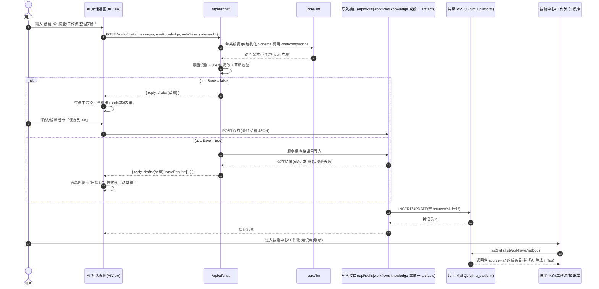

# AI 助手产物「创建即入库」增量 PRD

## 1. 项目信息

- 语言：中文
- 产品：仿 alon-workbench 风格的智能工作台（前台工作台 alon-workbench + 配套管理后台 admin-platform）
- 模块：AI 助手 → 技能中心 / 工作流 / 知识库 三中心的「AI 生成产物入库」
- 项目代号：`ai_creation_integration`
- 原始需求（复述）：用户在 AI 助手对话中让 AI 创建一个新技能 / 工作流 / 整理一篇知识文档，产出应能直接集成存储到工作台中，随后用户可在技能中心、工作流、知识库直接查找到对应条目。

## 2. 现状校验结论（与代码核对后）

> PRD 术语与现状代码一致：技能 type = `shell | prompt | http`，配置存于 `skills.config`(JSON)；工作流 steps 类型 = `shell | http | template | skill | llm`，定义存于 `workflows.definition`(JSON)；知识库为 `docs`(title/category/tags/content/pinned/created_by) + `categories`。

1. **数据底座实为共享 MySQL，非 SQLite**：`alon-workbench/core/db.ts` 已直连 MySQL 库 `qimu_platform`（mysql2 连接池），与 admin-platform 后端共用同一库同一批表（skills/workflows/docs/categories/ai_config…）。`data/workbench.db` 是历史遗留文件，未在现行核心链路使用。→ 因此"落库并同步后台"的实际含义是**写入共享 MySQL 表后前后台同源立即可见**，不需要跨服务搬运；执行类运行记录沿用 `/hub` 代理上报 Spring Boot(8080) 即可。
2. **前台当前写接口不完整**：前台 `/api/knowledge` 已有 `POST`（createDoc 可直接写 docs）；但 `/api/skills`、`/api/workflows` 仅提供列表/详情/同步(sync)/执行(run)，**没有 DB 新增接口**（创建能力只在 admin-platform Spring `POST /api/skills`、`POST /api/workflows`，以及文件目录播种同步）。
3. **来源标记无统一字段**：技能把 `source` 塞在 config JSON、工作流把 `source` 塞在 definition JSON（默认 `admin`）、文档只有 `created_by`，三表均无统一 `source` 列。
4. **对话链路为纯文本**：`/api/ai/chat` 只回文本 reply（可选 RAG usedDocs），AIView 只渲染气泡，无法承载结构化草稿卡与保存动作。

## 3. 背景与目标（一句话）

在 AI 对话内让 AI 产出**可预览、可编辑、可保存**的技能/工作流/知识文档草稿，一键（或自动）写入共享 MySQL 并在技能中心、工作流、知识库及管理后台列表中直接可见，带清晰"AI 生成"来源标记。

## 4. 用户故事

1. 作为普通用户，我在 AI 助手输入"帮我创建一个调用 xxx 接口的 HTTP 技能，名为 fetch-stats"，期望对话里直接出现一张**技能草稿卡**（含 type/params/config 摘要），点「保存到技能中心」即可入库，随后在技能中心搜索到它。
2. 作为普通用户，我在 AI 助手输入"帮我写一个先抓数据再调用大模型总结的工作流"，期望 AI 返回**工作流草稿卡**（步骤列表 steps 可展开预览），我确认后保存，工作流列表立即可见并可运行。
3. 作为普通用户，我让 AI"把这周运维要点整理成一篇知识文档"，期望得到**知识文档草稿卡**（标题/分类/标签/正文 Markdown 预览），保存后知识库可检索到该文档。
4. 作为懒于逐条确认的用户，我开启 AI 对话内的「自动保存」开关后，AI 产出的技能/工作流/知识将**自动入库**，消息内直接给出保存结果（成功/已存在/失败原因）。
5. 作为管理员，我在管理后台的技能/工作流/知识库列表中能看到前台 AI 生成的条目，并能通过来源标记区分「AI 生成」与「手动」。

## 5. 需求池

### P0（必须有，MVP 验收项）

| # | 需求 | 说明 / 验收口径 |
|---|---|---|
| P0-1 | 对话内结构化产出 | `/api/ai/chat` 在识别到"创建技能/工作流/整理知识"意图时，返回 `reply` 之外的结构化 `drafts`（每条含 kind=skill/workflow/knowledge 及完整定义字段），并在气泡下方渲染草稿卡。校验失败/无法解析时回落纯文本并明示"未能生成结构化产物"。 |
| P0-2 | 草稿卡预览 + 字段可编辑 | 草稿卡以表单形态展示关键字段（技能：name/type/params/config 摘要；工作流：name/steps 列表；文档：title/category/tags/content），支持用户在卡片内修改后保存；保存时前端带最终草稿 JSON 到写入接口。 |
| P0-3 | 手动「保存到 XX」 | 草稿卡提供主操作「保存到技能中心 / 保存为工作流 / 保存到知识库」，调用新写入接口成功落库后，卡片变已保存态并给出对应 ID。 |
| P0-4 | 自动保存开关 | AI 对话工具栏新增「自动保存」Switch（默认关，localStorage 持久化，仿照「参考知识库」开关实现）。开启后服务端识别到结构化产出即自动入库，并在消息中返回保存结果（成功/重名/失败原因），不成功时仍以草稿卡形态展示供手动保存。 |
| P0-5 | 三中心可查 | 保存/自动保存后：技能中心（SkillsView）、工作流（WorkflowsView）、知识库（KnowledgeView）在刷新后立即列出新条目（与现状 listSkills/listWorkflows/listDocs 同源，DB 权威）。 |
| P0-6 | 来源标记 | 落库产物带来源标记 `AI 生成`（默认值 `manual`/`file`）。三中心列表/详情在条目上加来源 Tag（建议：`AI 生成` 用 geekblue/cyan 小 Tag + RobotOutlined 图标）；管理后台对应列表也展示同一标记。 |

### P1（应该有）

| # | 需求 | 说明 |
|---|---|---|
| P1-1 | 新增前台写接口 | 新增 `POST /api/skills`、`POST /api/workflows`（对齐 admin-platform 同名校验与 config/definition JSON 结构），或提供统一 `POST /api/ai/artifacts` 写入器（写入 skills/workflows/docs 三表其一）——由架构师定夺；知识库复用既有 `POST /api/knowledge`。 |
| P1-2 | 同名覆盖 / 去重策略 | name 唯一冲突时：a) 提示"已存在同名技能/工作流"，提供【覆盖更新】【另存新名】【放弃】三选一（推荐）；知识文档同名不作硬约束。 |
| P1-3 | 草稿服务端校验 | 服务端复用/对齐现有校验规则：技能 name `^[a-z][a-z0-9-]*$`、type∈shell/prompt/http、config 完整性；工作流 steps 非空且每步 type/字段合法；知识 title 非空。校验失败给出人话错误，不在前端拼凑。 |
| P1-4 | AI 产物文件落地（可选） | AI 技能/工作流默认仅写 DB（dir 指向 name）；对 shell 类技能若磁盘目录不存在则执行期兜底 cwd=skills 根目录，避免运行失败。是否同时写 `skills/<name>/skill.yml`、`workflows/<name>.yml` 作为可溯源备份，由架构师权衡。 |

### P2（nice to have）

| # | 需求 | 说明 |
|---|---|---|
| P2-1 | 对话快捷指令 | 输入 `/create-skill <需求>`、`/create-workflow <需求>`、`/create-doc <需求>` 直接触发对应产物生成，收敛意图识别误差。 |
| P2-2 | 产物模板 | 对话上方提供「技能模板 / 工作流模板 / 知识模板」快捷项，点击后预填骨架再让 AI 补全，提高生成可用率。 |
| P2-3 | 批量导入 | 支持一次对话产出多个技能/工作流/文档草稿，批量预览与保存（drafts 数组天然支持）。 |

## 6. 关键交互流程

## 7. UI 概要

1. **草稿卡在对话流中的形态**：AI 气泡（白色圆角，右侧 AI 头像）内部，Markdown 正文下方渲染一张 `Card`（圆角 12、浅紫主题呼应 #722ed1）。卡片头部为「目标类型徽标 + 标题」，如 `[技能] fetch-stats`、`[工作流] daily-report`、`[知识] 运维周报`；主体为紧凑预览（技能参数/HTTP 配置、工作流步骤 Timeline 化、文档正文前几行 + 字数）；底部一行操作按钮：`保存到技能中心/保存为工作流/保存到知识库`（主按钮，紫色底）、`编辑`（展开字段表单）、保存成功后按钮禁用并展示 `✓ 已保存 #id`。卡片不进入 localStorage 历史重渲染？→ 与对话历史一致：历史加载时同结构恢复（草稿卡仍需携带 draft 字段，保存后可折叠为结果行）。建议 ChatItem 增加可选 `drafts`/`saveResults` 字段并做兼容校验。
2. **自动保存开关位置**：AI 对话工具栏「参考知识库（RAG）」旁新增 `Switch size="small"` + 文案「自动保存产物」，持久化 `alon:chat:autoSave`；开启时不影响纯问答。
3. **来源 Tag 样式**：
   - 技能中心卡片/抽屉：在 type Tag 旁加 `<Tag color="geekblue" icon={<RobotOutlined/>}>AI 生成</Tag>`（手动类不加，或 `manual` 用 default 灰 Tag）。
   - 工作流卡片同技能；知识库列表/详情在分类 Tag 旁加同款来源 Tag。
   - 管理后台（admin-platform）对应管理列表同样显示该 Tag（skills/workflows 由 Spring 列表接口多透出 source；docs 建议用新列/created_by 约定）。
4. **与现有组件融合**：ChatMarkdown 保持纯渲染不动；草稿卡作为独立 `DraftCard.tsx` 组件，在 AIView 气泡的 usedDocs 区域之上渲染；配色沿用现有紫色渐变/白卡片风格，不新引入视觉体系。

## 8. 待确认问题（开放给主理人/架构师，≤3）

1. **来源标记落点**：为统一前后台展示，建议给 `skills`/`workflows`/`docs` 三表加统一 `source VARCHAR(16) DEFAULT 'manual'` 列并补一次 schema ALTER（spring schema.sql 只建不改，需额外迁移）。是否接受此 schema 变更？还是技能/工作流继续藏在 JSON（config/definition.source）、知识用 tag/created_by 约定，避免改表？
2. **写入通道归属**：AI 保存走**前台新增 Next API 写接口**（直接写共享 MySQL，推荐，简单同源），还是复用 admin-platform `POST /api/skills|/api/workflows`（经 `/hub` 代理，多一跳 + 认证）？是否允许前台 API 也支持用户直接新增技能/工作流（即顺带把现有三中心"只能读不能增"的能力补齐）？
3. **AI 产物文件形态**：AI 技能/工作流仅落 DB 即可被列表/执行使用（shell 技能需处理无目录 cwd 兜底）；是否还要求同时落 `skills/<name>/skill.yml` / `workflows/<name>.yml` 以便文件溯源与备份（增加写入复杂度）？

## 9. 成功指标（验收口径）

- P0 全项演示通过：一次"帮我创建 X 技能/工作流/知识"对话即可产出可编辑草稿卡 → 保存（或自动保存）→ 在对应中心刷新可见，且带「AI 生成」Tag。
- 管理后台列表可见 AI 生成条目（P1 联调后验收）。
- 既有纯问答、RAG、网关选择等能力无回归（对话历史、气泡渲染不受影响）。

---

## 10. P2 增强已交付（2026-09-04 增量）

| # | 需求 | 状态 | 落地 |
|---|---|---|---|
| P2-1 | 对话快捷指令 | ✅ 已实现 | `/create-skill <描述>`、`/create-workflow <描述>`、`/create-doc`（别名 `/create-knowledge`）。服务端 `core/ai/commands.ts` 解析 + chat route 注入「只产出该 kind」系统约束，并把模型跑偏的其它类型草稿过滤掉。 |
| P2-2 | 产物模板 | ✅ 已实现 | AI 对话输入框上方「快捷创建：技能 / 工作流 / 知识文档」三枚 chips，点击预填 `/create-*` 骨架文案到输入框（聚焦待补全），发送即走快捷指令通道。模板定义于 `core/ai/commands.ts#QUICK_TEMPLATES`。 |
| P2-3 | 批量导入/保存 | ✅ 已实现 | 多产物（草稿数组）自 P0 已支持；本次新增多草稿卡顶部「全部保存」批量按钮（逐卡以 create 模式保存，跳过已保存/冲突/保存中/JSON 有误项），DraftCard 通过 `handleRef` 暴露 `saveNow()` 命令式句柄。 |
